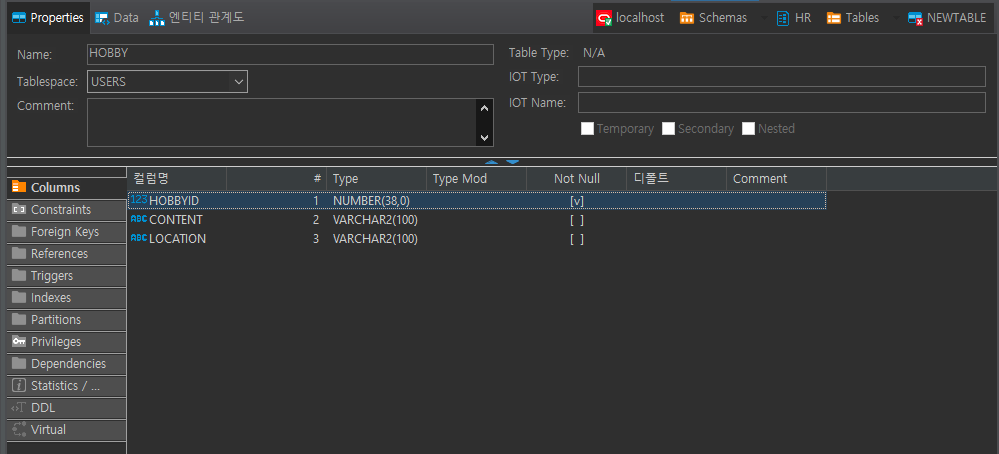

<h1>DBMS (DataMase Management System):black_nib:</h1>

  <h3>:heavy_check_mark: 데이터의 종류</h3>

- **정형**  :  항목이 정해진 데이터
- **반정형** : 항목을 설정할 수 있으나 유동적
- **비정형** : 항목설정할 수 없음. 문서, 영상, 사운드 등
 

<h3>:heavy_check_mark: 데이터의 특징</h3>

- **실시간 접근성** : 실시간 접근 가능해야 한다.
- **계속적인 변화** : 항상 최근의 정확한 데이터로 변화
- **동시공유** : 여러 사용자가 동시에 공유
- **내용에 의한 참조** : 참조시 주소 등의 위치가 아닌 내용으로 참조
 

<h3>:heavy_check_mark: SQL(Structured Query Language) - 명령어의 역할에 따른 분류</h3>

|용어|역할|sql|
|:---:|:---:|:---:|
|*DDL (Data Definition Language)*|데이터 항목 정의|create, alter, drop, truncate|
|*DML (Data Manipulation Language)*|데이터 조작|insert, select, update, delete|
|*DCL (Data Control Language)*|DBMS 제어(계정관리, 백업/복원)|grant, revoke backup, restore|
|*TCL (Transaction Control Language)*|트랜잭션 제어|commit, rollback|

 

<h2>[개념정리]</h2>

- [x] **정형데이터란?**  
*저장할 데이터(항목)가 정해져있는 데이터*

- [x] **DBMS란?** 
*데이터베이스관리시스템, DB를 관리해주는 프로그램 즉, DB프로그램*

- [x] **당신이 알고있는 DBMS의 종류 2가지 이상** 
*오라클, mySQL*

- [x] **SQL은 무엇의 약자인가?** 
*Structured Query Language (체계적으로 정리된 명령어들의 모음)*

- [x] **SQL의 종류 3가지 분류** 
*DDL, DML, DCL*

- [x] **CRUD는 무엇의 약자인가?** 
*Create Read Update Delete*

- [x] **당신이 알고있는 DB클라이언트 프로그램은?** 
*DBeaver*

- [x] **DML중 데이터를 넣을 때 사용하는 구문은?** 
*insert*

- [x] **DML중 데이터를 검색할 때 사용하는 구문은?** 
*select*
 

<h2>[실습문제]</h2>

**1. DBeaver를 사용하여 hobby테이블을 생성하시오(hobbyid, content, location)**  

 

**2. hobby테이블에서 DDL을 생성하여 hobby2 테이블을 생성하시오.** 
*CREATE TABLE "HR"."HOBBY2" 
   (	"HOBBYID" NUMBER(38,0) NOT NULL ENABLE, 
	"CONTENT" VARCHAR2(100), 
	"LOCATION" VARCHAR2(100)
   )*
   
 

**3. hobby테이블에 SQL문을 사용하여 1)100, 'run', 'seoul' 2)200, 'book', 'busan'을 입력** 
*insert into hobby values (100, 'run', 'seoul')*
*insert into hobby values (200, 'book', 'busan')*

 

**4. hobby테이블에 SQL문을 사용하여 1)전체 내용을 검색, 2)content만 검색, 3) location, content검색**  
*select * from "hobby"*
*select content from "hobby"*
*select content, location from "hobby"*

 

