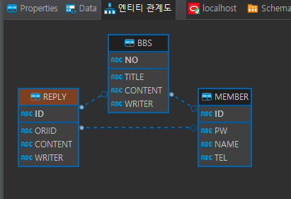

<h2>
  데이터베이스 (Database, DB) 용어정리
</h2>

### ✔️ RDBMS

  여러 개의 테이블이 특정 관계로 이루어져 있는 구조를 가진 관계형 데이터 베이스  
  
### ✔️ 엔터티 (Entity)

  실제, 독립체라는 뜻으로 데이터 모델링에서 사용되는 객체. 즉, 정보를 저장하고 관리하기 위한 <b>Thing</b>  
  
    - 데이터의 집합 ( 예시 : DB테이블 )
    - 저장되고, 관리되어야 하는 데이터
    - 개념, 장소, 사건 등을 가리킴.
    - 유형 혹은 무형의 대상을 가리킴
  
### ✔️스키마 (Schema)

데이터 베이스를 구성하는 데이터 개체(Entity), 속성(Attribute), 관계(Relationship)등을 정의한 것
즉, DB내에 어떤 구조로 데이터가 저장되는지를 나타내는 DB구조를 뜻하는 용어

  

  
<b>사용자의 관점에 따라 3가지로 구분</b>

  
  - **외부단계(외부스키마)** 
    실제 정리되지 않은 상태의 데이터들을 파악하는 과정, 사용자의 입장에서 정의한 DB의 논리적 구조 
  
        외부 단계에서 사용자에게 필요한 DB를 정의, 사용자의 관점에서의 데이터(부서별, 개인별 사용자)
        전체 DB의 한 논리적인 부분으로 볼 수 있기 때문에 서브스키마라고도 한다
  
  - **개념단계(개념스키마)** 
    저장하기 위해 논리적/개념적으로 정리하는 과정, DB의 전체적인 논리적 구조 
        
        - 외부단계에서 각 사용자가 사용하기 위해 전체적으로 어떻게 저장되어야 하는가 (조직 전체의 관점)
        - 모든 응용 프로그램이나 사용자들이 필요로 하는 데이터를 종합한 조직 전체의 DB로 하나만 존재

  - **내부단계(내부스키마)** 
    컴퓨터의 특정위치에 특절한 파일이름으로 저장하는 과정, 물리적인 저장 장치의 관점 
    
        - 전체 DB가 저장 장치에 실제로 저장되는 방법에 대해 정의한 것
        - 레코드 구조, 필드 크기, 레코드 접근 경로 등 물리적인 저장 구조를 정의
  
  
 

#### ***DB는 저장할 대상을 선정하고 대상에 어떤 속성(컬럼, 항목)들을 정의해야 한다***
  

 

### ERD (Entity Relationship Diagram)

    ER다이어그램이라고 불리우며 ERD라고 줄여 부르기도 한다.
    존재하고 있는 것(Entity)들의 관계(RelationShip)을 나타낸 도표(Diagram)'이다

### 용어정리

    -  명령어보다는 스키마 설계에 집중해야함
    -  어떤 데이터를 db에 저장할 것인가를 선별해내는 것이 중요!
    -  스키마, 엔터티(엔티티), 속성, instance(실제데이터)

   + RDB (Relational DB, 관계형DB)
   + 저장할 데이터간 "관계성"을 고려하여 저장하는 방식

   + 개체(entity, 엔티티)
   엔터티 관계 그림(Entity Relational Diagram, ERD)
   + 쇼핑몰의 개체들: 회원, 게시판, 상품, 주문, 장바구니
   + 회원개체를 테이블로 저장: 특성(속성, attribute, property, item, field)을 추출하여 저장

 

 ***테이블 3대요소 : 테이블 이름, 컬럼이름, 컬럼조건***

 

### 핵심정리

    DML 데이터조작어
    CRUD - Create, Read, Update, Delete
    SQL  - insert, select, update, delete

- Create : sysdate, default, sequence, unique 
- Read : where, distinct, order by, and, or, not, in 
- Update : where, cell단위(칸) 
- Delete : where, record단위(행), commit/rollback 대상(취소가능, truncate와 비교-취소불가능)

 

<h2>PK(기본키)와 FK(외래키)</h2>

- **기본키 (중요키, 우선키, primary key(PK))** *not null, unique*
	- 후보키 : 항목들 중 유일하고 꼭 값이 있어서 데이터를 구분할 수 있는 항목
	- 후보키 중 하나를 선택하여 중요키로 설정함.
	- 검색이나 다른 테이블과 조인할 때 사용함
 	- 학생테이블(학생id, 주민no) -> 학생의 이름은 기본키가 될수 없음 why?
	- 기본키가 되기 위한 조건(개체무결성) : 값이 유일(unique)해야하며, 비어 있으면 안된다(not null)

 

- **외래키(foreign key(FK))**
	- 다른 테이블의 유일한 키(기본키 포함)을 연결하여 사용하는 항목
	- bbs의 writer는 외부 다른 테이블의 기본키를 연결함
	- 외래키를 설정한다고 함.
	- 외부 테이블의 키(항목)을 참조(연결)하여 사용
	- 값이 범위를 자동체크 -> 외래키에 들어있지 않은 값을 넣는 경우 에러체크 해줌.
	-> 결점이 없는 데이터를 넣게 됨. ( 참조 무결성 )

 

